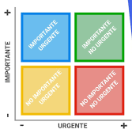
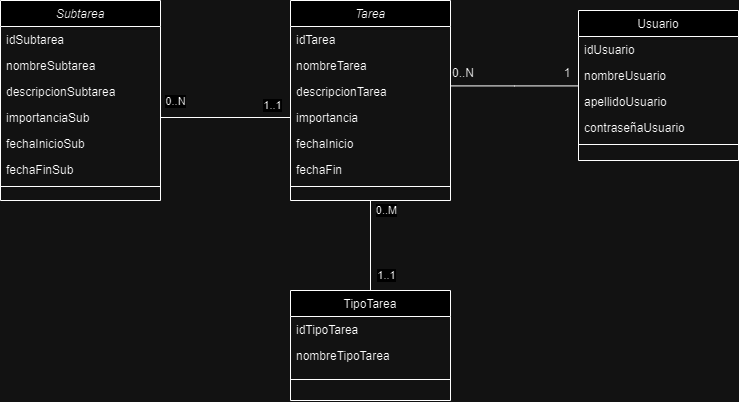

# Trabajo Práctico: Desarrollo de Software

## Propuesta

Sistema de gestión de tareas

## Integrantes

- Calderon Bruno - 48881
- Rallip Sanchez Ismael - 51392

## Descripción del Proyecto

Un sistema que administre tareas creadas por el usuario con una clasificación propia (vida personal / estudio / trabajo ), con fechas límites asociadas a un calendario que se podrá filtrar por tipo o nivel de urgencia de la tarea. Las tareas tendrán un título, descripción, un apartado para subir archivos, y podrán contener subtareas.

El sistema enviará notificaciones pertinentes a cuántos días quedan para la entrega de una tarea específica (las notificaciones serán predeterminadas o podrán programarse previamente) para hacer recordar. Se podrá filtrar por tareas urgentes e importantes (1).

Nos basamos en Notion mezclado con Classroom.

(1).

## Diagrama de clases (boceto)

## notas sobre el trabajo

### Entrega del 8/4 :

En esta primera entrega, desarrollamos la descripción del proyecto y definimos el tipo de tarea como el primer CRUD a desarrollar.

Tipos de tarea: vida personal / estudio / trabajo.

### Entrega del 24/5:

Para esta segunda entrega, agregamos el archivo CRUDTipoTareas.js, donde se define la clase TipoDeTareas y se definen funciones para crear (ingresando el nombre y el código se genera de manera automática y secuencial), leer (por código), actualizar (ingresando el código y el nuevo nombre), eliminar (ingresando el código) y listar los tipos de tarea. Además, en el archivo EjemploTipoTareas.js, probamos que la clase y las funciones realicen su función correctamente.
